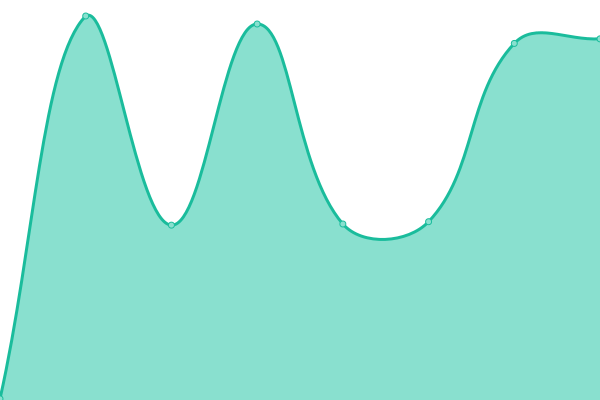
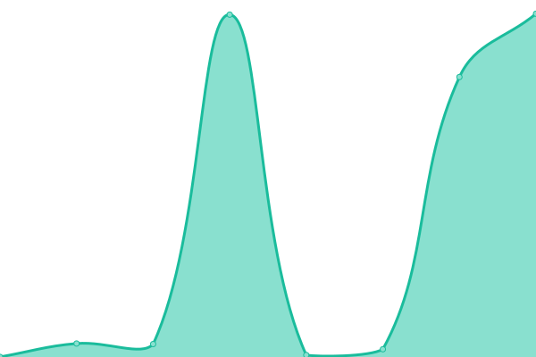

# [📈 Live Status](https://demo.upptime.js.org): <!--live status--> **🟧 Partial outage**

This repository contains the open-source uptime monitor and status page for [Isaac Alejandro López Castrejón]( IN: https://www.linkedin.com/in/isaac-alejandro-l%C3%B3pez-castrej%C3%B3n-a562a167/), powered by [Upptime](https://github.com/upptime/upptime).

With [Upptime](https://upptime.js.org), you can get your own unlimited and free uptime monitor and status page, powered entirely by a GitHub repository. We use [Issues](https://github.com/ialopezc/upptime/issues) as incident reports, [Actions](https://github.com/ialopezc/upptime/actions) as uptime monitors, and [Pages](https://demo.upptime.js.org) for the status page.

<!--start: status pages-->
<!-- This summary is generated by Upptime (https://github.com/upptime/upptime) -->
<!-- Do not edit this manually, your changes will be overwritten -->
<!-- prettier-ignore -->
| URL | Status | History | Response Time | Uptime |
| --- | ------ | ------- | ------------- | ------ |
|  [Efectivale .com.mx](http://www.efectivale.com.mx/) | 🟩 Up | [efectivale-com-mx.yml](https://github.com/ialopezc/upptime/commits/HEAD/history/efectivale-com-mx.yml) | 

 2994ms
     
 | 

<a href="https://ialopezc.github.io/upptime/history/efectivale-com-mx">99.57%</a>
    

|  [Efectivale .com.mx certificado ssl](https://www.efectivale.com.mx/) | 🟥 Down | [efectivale-com-mx-certificado-ssl.yml](https://github.com/ialopezc/upptime/commits/HEAD/history/efectivale-com-mx-certificado-ssl.yml) | 

 0ms
     
 | 

<a href="https://ialopezc.github.io/upptime/history/efectivale-com-mx-certificado-ssl">100.00%</a>
    

|  Efectivale .com.mx TEST | 🟩 Up | [efectivale-com-mx-test.yml](https://github.com/ialopezc/upptime/commits/HEAD/history/efectivale-com-mx-test.yml) | 

 444ms
     
 | 

<a href="https://ialopezc.github.io/upptime/history/efectivale-com-mx-test">100.00%</a>
    

|  Efectivale .com.mx TEST certificado ssl | 🟩 Up | [efectivale-com-mx-test-certificado-ssl.yml](https://github.com/ialopezc/upptime/commits/HEAD/history/efectivale-com-mx-test-certificado-ssl.yml) | 

 206ms
     
 | 

<a href="https://ialopezc.github.io/upptime/history/efectivale-com-mx-test-certificado-ssl">100.00%</a>
    

|  [Efectivale .com](http://www.efectivale.com/combustible1/) | 🟩 Up | [efectivale-com.yml](https://github.com/ialopezc/upptime/commits/HEAD/history/efectivale-com.yml) | 

 251ms
     
 | 

<a href="https://ialopezc.github.io/upptime/history/efectivale-com">100.00%</a>
    

|  [Efectivale .com certificado ssl](https://www.efectivale.com/combustible1/) | 🟩 Up | [efectivale-com-certificado-ssl.yml](https://github.com/ialopezc/upptime/commits/HEAD/history/efectivale-com-certificado-ssl.yml) | 

 217ms
     
 | 

<a href="https://ialopezc.github.io/upptime/history/efectivale-com-certificado-ssl">100.00%</a>
    

|  [Vales de Gasolina](http://www.valesdegasolina.com/) | 🟩 Up | [vales-de-gasolina.yml](https://github.com/ialopezc/upptime/commits/HEAD/history/vales-de-gasolina.yml) | 

 897ms
     
 | 

<a href="https://ialopezc.github.io/upptime/history/vales-de-gasolina">99.95%</a>
    

|  [Vales de Gasolina certificado ssl](https://www.valesdegasolina.com/) | 🟩 Up | [vales-de-gasolina-certificado-ssl.yml](https://github.com/ialopezc/upptime/commits/HEAD/history/vales-de-gasolina-certificado-ssl.yml) | 

 250ms
     
 | 

<a href="https://ialopezc.github.io/upptime/history/vales-de-gasolina-certificado-ssl">100.00%</a>
    

|  Vales de Gasolina TEST | 🟩 Up | [vales-de-gasolina-test.yml](https://github.com/ialopezc/upptime/commits/HEAD/history/vales-de-gasolina-test.yml) | 

 448ms
     
 | 

<a href="https://ialopezc.github.io/upptime/history/vales-de-gasolina-test">100.00%</a>
    

|  Vales de Gasolina TEST certificado ssl | 🟩 Up | [vales-de-gasolina-test-certificado-ssl.yml](https://github.com/ialopezc/upptime/commits/HEAD/history/vales-de-gasolina-test-certificado-ssl.yml) | 

 207ms
     
 | 

<a href="https://ialopezc.github.io/upptime/history/vales-de-gasolina-test-certificado-ssl">100.00%</a>
    

|  [Vales de Despensa](http://www.valesdedespensa.com/) | 🟥 Down | [vales-de-despensa.yml](https://github.com/ialopezc/upptime/commits/HEAD/history/vales-de-despensa.yml) | 

 0ms
     
 | 

<a href="https://ialopezc.github.io/upptime/history/vales-de-despensa">100.00%</a>
    

|  [Vales de Despensa certificado ssl](https://www.valesdedespensa.com/) | 🟥 Down | [vales-de-despensa-certificado-ssl.yml](https://github.com/ialopezc/upptime/commits/HEAD/history/vales-de-despensa-certificado-ssl.yml) | 

 0ms
     
 | 

<a href="https://ialopezc.github.io/upptime/history/vales-de-despensa-certificado-ssl">100.00%</a>
    

|  Vales de Despensa TEST | 🟩 Up | [vales-de-despensa-test.yml](https://github.com/ialopezc/upptime/commits/HEAD/history/vales-de-despensa-test.yml) | 

 375ms
     
 | 

<a href="https://ialopezc.github.io/upptime/history/vales-de-despensa-test">100.00%</a>
    

|  Vales de Despensa TEST certificado ssl | 🟩 Up | [vales-de-despensa-test-certificado-ssl.yml](https://github.com/ialopezc/upptime/commits/HEAD/history/vales-de-despensa-test-certificado-ssl.yml) | 

 176ms
     
 | 

<a href="https://ialopezc.github.io/upptime/history/vales-de-despensa-test-certificado-ssl">100.00%</a>
    

|  [Efectimapas](http://efectimapas.com/) | 🟩 Up | [efectimapas.yml](https://github.com/ialopezc/upptime/commits/HEAD/history/efectimapas.yml) | 

 566ms
     
 | 

<a href="https://ialopezc.github.io/upptime/history/efectimapas">100.00%</a>
    

|  [Efectimapas certificado ssl](https://efectimapas.com/) | 🟩 Up | [efectimapas-certificado-ssl.yml](https://github.com/ialopezc/upptime/commits/HEAD/history/efectimapas-certificado-ssl.yml) | 

 388ms
     
 | 

<a href="https://ialopezc.github.io/upptime/history/efectimapas-certificado-ssl">100.00%</a>
    

|  Automatic Saving Tools | 🟩 Up | [automatic-saving-tools.yml](https://github.com/ialopezc/upptime/commits/HEAD/history/automatic-saving-tools.yml) | 

 354ms
     
 | 

<a href="https://ialopezc.github.io/upptime/history/automatic-saving-tools">100.00%</a>
    

|  Automatic Saving Tools certificado ssl | 🟩 Up | [automatic-saving-tools-certificado-ssl.yml](https://github.com/ialopezc/upptime/commits/HEAD/history/automatic-saving-tools-certificado-ssl.yml) | 

 205ms
     
 | 

<a href="https://ialopezc.github.io/upptime/history/automatic-saving-tools-certificado-ssl">100.00%</a>
    

|  Sistema de leads | 🟩 Up | [sistema-de-leads.yml](https://github.com/ialopezc/upptime/commits/HEAD/history/sistema-de-leads.yml) | 

 366ms
     
 | 

<a href="https://ialopezc.github.io/upptime/history/sistema-de-leads">100.00%</a>
    

|  Sistema de leads certificado ssl | 🟩 Up | [sistema-de-leads-certificado-ssl.yml](https://github.com/ialopezc/upptime/commits/HEAD/history/sistema-de-leads-certificado-ssl.yml) | 

 210ms
     
 | 

<a href="https://ialopezc.github.io/upptime/history/sistema-de-leads-certificado-ssl">100.00%</a>
    

|  [CMS Facebook](http://www.efectivale.com/cms/) | 🟩 Up | [cms-facebook.yml](https://github.com/ialopezc/upptime/commits/HEAD/history/cms-facebook.yml) | 

 205ms
     
 | 

<a href="https://ialopezc.github.io/upptime/history/cms-facebook">100.00%</a>
    

|  [CMS Facebook certificado ssl](https://www.efectivale.com/cms/) | 🟩 Up | [cms-facebook-certificado-ssl.yml](https://github.com/ialopezc/upptime/commits/HEAD/history/cms-facebook-certificado-ssl.yml) | 

 260ms
     
 | 

<a href="https://ialopezc.github.io/upptime/history/cms-facebook-certificado-ssl">100.00%</a>
    

|  [EfectiNet](http://www.efectivale.com.mx/efectinet/login) | 🟥 Down | [efecti-net.yml](https://github.com/ialopezc/upptime/commits/HEAD/history/efecti-net.yml) | 

 109ms
     
 | 

<a href="https://ialopezc.github.io/upptime/history/efecti-net">100.00%</a>
    

|  [EfectiNet certificado ssl](https://www.efectivale.com.mx/efectinet/login) | 🟥 Down | [efecti-net-certificado-ssl.yml](https://github.com/ialopezc/upptime/commits/HEAD/history/efecti-net-certificado-ssl.yml) | 

 0ms
     
 | 

<a href="https://ialopezc.github.io/upptime/history/efecti-net-certificado-ssl">100.00%</a>
    

|  [Efectifintech](http://www.efectifintech.com.mx/) | 🟩 Up | [efectifintech.yml](https://github.com/ialopezc/upptime/commits/HEAD/history/efectifintech.yml) | 

 429ms
     
 | 

<a href="https://ialopezc.github.io/upptime/history/efectifintech">100.00%</a>
    

|  [Efectifintech certificado ssl](https://www.efectifintech.com.mx/) | 🟩 Up | [efectifintech-certificado-ssl.yml](https://github.com/ialopezc/upptime/commits/HEAD/history/efectifintech-certificado-ssl.yml) | 

 239ms
     
 | 

<a href="https://ialopezc.github.io/upptime/history/efectifintech-certificado-ssl">100.00%</a>
    

|  [Va Contigo](http://www.efectivalebeneficios.com/) | 🟩 Up | [va-contigo.yml](https://github.com/ialopezc/upptime/commits/HEAD/history/va-contigo.yml) | 

 1878ms
     
 | 

<a href="https://ialopezc.github.io/upptime/history/va-contigo">100.00%</a>
    

|  [Va Contigo certificado ssl](https://www.efectivalebeneficios.com/) | 🟩 Up | [va-contigo-certificado-ssl.yml](https://github.com/ialopezc/upptime/commits/HEAD/history/va-contigo-certificado-ssl.yml) | 

 1388ms
     
 | 

<a href="https://ialopezc.github.io/upptime/history/va-contigo-certificado-ssl">100.00%</a>
    

<!--end: status pages-->

[**Visit our status website →**](https://demo.upptime.js.org)

## 📄 License

- Powered by: [Upptime](https://github.com/upptime/upptime)
- Code: [MIT](./LICENSE) © [Isaac Alejandro López Castrejón]( IN: https://www.linkedin.com/in/isaac-alejandro-l%C3%B3pez-castrej%C3%B3n-a562a167/)
- Data in the `./history` directory: [Open Database License](https://opendatacommons.org/licenses/odbl/1-0/)
